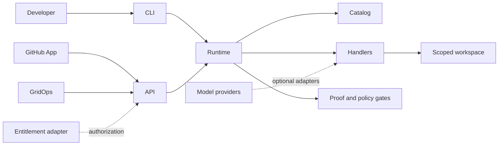

# Architecture

## System context

## Components

- `registry/`: canonical catalog, JSON Schema, and distributable manifests.
- `packages/core/`: catalog loader, validation, runtime, types, and bounded handlers.
- `apps/api/`: HTTP control plane.
- `apps/cli/`: local operator interface.
- `docs/`: product, architecture, governance, operations, and integration guidance.
- `examples/`: copy-paste API and CLI examples.

## Trust boundaries

1. **Request boundary:** validate identifiers, body size, and input shape.
2. **Catalog boundary:** only known manifests and known handler names execute.
3. **Permission boundary:** manifest permissions document expected access; runtime adapters must enforce it.
4. **Workspace boundary:** file operations resolve within the selected workspace.
5. **Credential boundary:** credentials enter through environment-specific adapters, never manifests.
6. **Proof boundary:** mutation results are not trusted until required checks run and their outputs are recorded.

## Extension rule

A new capability requires all of the following:

1. Manifest and catalog entry.
2. Typed input/output contract.
3. Explicit handler registration.
4. Permission declaration.
5. Unit tests and failure tests.
6. Documentation and example.
7. Security review when network, process, secrets, or mutation scope changes.
